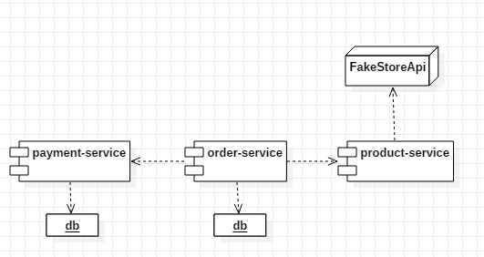

# Spring Ecommerce Microservices

## Project Overview

This project is a **microservices-based ecommerce system** built using Spring Boot. It manages the lifecycle of orders, products, and payments, with a clean separation of responsibilities.

## Architecture Diagram

This diagram illustrates the interaction between the services:



- **Order Service** uses its own database to store and manage order data.
- **Payment Service** maintains its own database for payment records.
- **Product Service** acts as a proxy to fetch product details from the **Fake Store API**, ensuring up-to-date product information without local storage.
- Logs related to each request include the trace-id for consistent and linked logging across all services.
- Each service can scale independently and is designed to follow RESTful principles.
---

## Microservice Endpoints

### Product Service (`http://localhost:8081/product-service`)
| Endpoint               | Method | Description                     | Example Request             |
|------------------------|--------|---------------------------------|-----------------------------|
| `/api/v1/products/{id}` | GET    | Fetch product by ID             | `GET /api/v1/products/12`   |

---

### Payment Service (`http://localhost:8082/payment-service`)
| Endpoint                                      | Method | Description                           | Example Request                     |
|-----------------------------------------------|--------|---------------------------------------|-------------------------------------|
| `/api/v1/payments/order/{orderId}`            | GET    | Fetch payment details for an order    | `GET /api/v1/payments/order/1`      |
| `/api/v1/payments/update/{id}/payment-status` | PATCH  | Update payment status                 | `PATCH /api/v1/payments/update/1/payment-status` <br> `{ "status": "PAID" }` |
| `/api/v1/payments/create`                     | POST   | Create a new payment                  | `POST /api/v1/payments/create` <br> `{ "orderId": 1234578, "amount": 150.75, "paymentMethod": "CREDIT_CARD", "traceId": "12345" }` |

---

### Order Service (`http://localhost:8083/order-service`)
| Endpoint                                      | Method | Description                           | Example Request                     |
|-----------------------------------------------|--------|---------------------------------------|-------------------------------------|
| `/api/v1/orders/{id}`                         | GET    | Fetch order by ID                     | `GET /api/v1/orders/1`              |
| `/api/v1/orders/customer/{customerId}`        | GET    | Fetch all orders by customer ID       | `GET /api/v1/orders/customer/1`     |
| `/api/v1/orders/update/{id}/payment-status`   | PATCH  | Update payment status of an order     | `PATCH /api/v1/orders/update/1/payment-status` <br> `{ "status": "DECLINED" }` |
| `/api/v1/orders/create`                       | POST   | Create a new order                    | `POST /api/v1/orders/create` <br> `{ "client": { "name": "josias", "email": "josias@alvarenga.com", "dui": "91055873-8" }, "products": [{"id": 1, "quantity": 1}, {"id": 3, "quantity": 1}], "paymentMethod": "CASH" }` |

---
### Swagger Endpoints
Each service has integrated Swagger for API documentation. You can explore the endpoints using the following links:

- **Product Service**: [Swagger UI](http://localhost:8081/product-service/swagger/swagger-ui/index.html)
- **Payment Service**: [Swagger UI](http://localhost:8082/payment-service/swagger/swagger-ui/index.html)
- **Order Service**: [Swagger UI](http://localhost:8083/order-service/swagger/swagger-ui/index.html)

---

## Running the Services

1. **Clone the Repository**:
   ```bash
   git clone https://github.com/Yosiak-alv/spring-ecommerce-microservices
   cd spring-ecommerce-microservices
   ```
Now you can run the services in your Ide.

2. **Optional: Running with Docker**
   ```bash
   docker compose build
   docker compose up
   ```